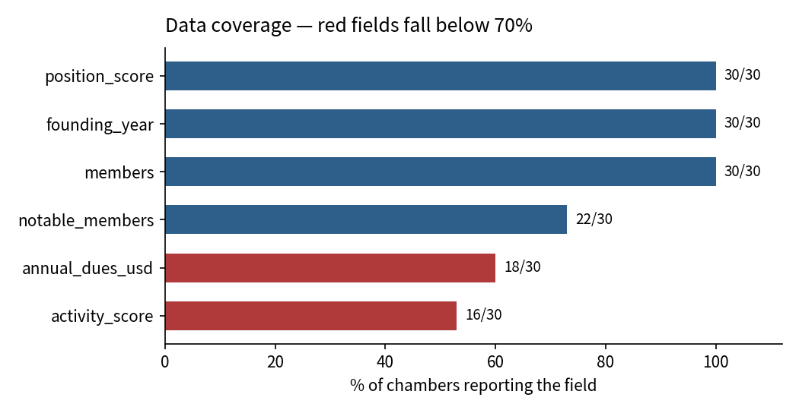
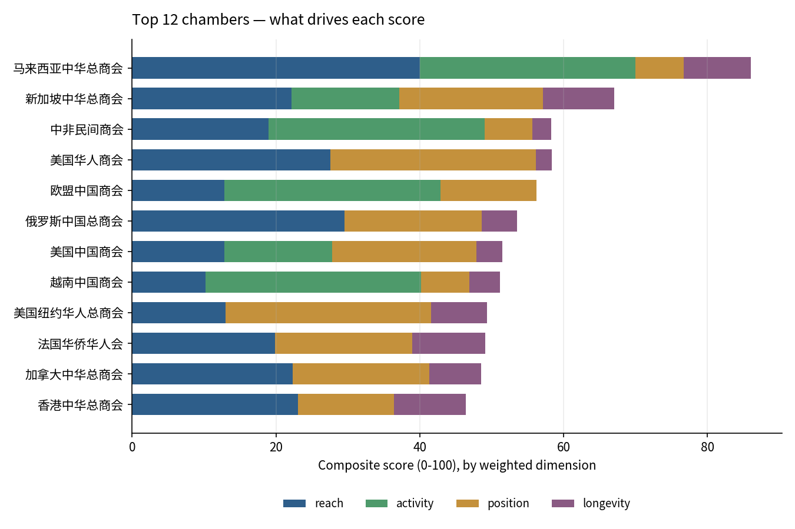

# Ranking Overseas Chinese Chambers of Commerce

A reproducible scoring pipeline for 30 overseas Chinese chambers of commerce across 26 cities and 9 regions.

> **Snapshot, not a live dataset.** Every figure here was compiled in **January 2025** and has not been refreshed since. Membership counts, leadership, and event programming will have moved on. Treat this as a fixed historical snapshot; the value of the repository is the method, not the current standings.

The original ranking was produced by hand during the **Standard Chartered × Forbes China Elite Editor Winter Camp** (January 2025), where I co-designed the scoring rules with my team. This repository rebuilds that work in Python so the ranking is reproducible, the weights are adjustable, and the missing-data handling is explicit rather than buried in a spreadsheet.

```bash
pip install -r requirements.txt
python src/run.py
python src/plot.py
```

## What the data looks like

30 chambers, 14 fields each. The workbook was compiled by hand, so numeric fields arrive as free text:

| Raw value | Parsed | Bound recorded |
|---|---|---|
| `11万` | 110,000 | — |
| `超700` | 770 | above |
| `少于500` | 400 | below |
| `1200多人` | 1,260 | above |
| `（唯一一个）0` | 0.0 (dues) | — |
| `na`, `-` | `None` | — |

Membership counts span **116 to 110,000**; founding years span **1900 to 2018**.

Qualified figures such as `超700` ("more than 700") are nudged from the stated number rather than discarded, and the direction of the bound is stored in a separate column so a reader can tell an exact count from an estimate.

## Scoring

Four dimensions, each min-max normalised to 0–1, combined as a weighted mean:

| Dimension | Source | Default weight |
|---|---|---|
| `reach` | membership size, log-scaled | 0.40 |
| `activity` | 1/3/5 score for 2024 event programming | 0.30 |
| `position` | 2–5 score for strategic value of the host city | 0.20 |
| `longevity` | years since founding, log-scaled | 0.10 |

`activity` and `position` are scoring dimensions my team defined during the camp. The other two are derived from the reported figures.

Weights are adjustable from the command line:

```bash
python src/run.py --weights reach=0.5,activity=0.3,position=0.2
```

### Two decisions that drive the result

**Membership is log-scaled.** The largest chamber has roughly 950× the members of the smallest. On a linear scale it would take the entire dimension and every other chamber would sit near zero, so `reach` would stop discriminating between the other 29.

**Missing values are not imputed.** Each chamber is scored on the dimensions it actually reports, and its weights are renormalised over those dimensions only. Every row carries a `weight_coverage` column showing how much of the intended weight was available, so a score of 58.3 at full coverage can be told apart from the same score at 0.7.

Annual dues are collected but **excluded from the composite**: only 18 of 30 chambers report a figure, and dues describe a pricing model rather than reach or influence.

## Coverage



Activity scores exist for 16 of 30 chambers. This is the main limitation of the ranking, and it is why `weight_coverage` is reported per row instead of being hidden.

## Results



The stacked bars show what each score is actually made of. Several chambers reach similar totals by different routes — some on membership size, others almost entirely on event activity — which a single ranked number would conceal.

Full output: [`output/ranking.csv`](output/ranking.csv)

## Layout

```
src/parse.py    text -> number parsers for the hand-entered fields
src/score.py    normalisation, weighting, composite score
src/run.py      pipeline entry point and coverage report
src/plot.py     figures
tests/          parser unit tests (pytest)
```

```bash
pytest tests/ -q
```

## Limitations

- **The data is a January 2025 snapshot and is not maintained.** Membership counts, presidents, and 2024 flagship events were accurate as compiled and are now out of date. Re-running the pipeline reproduces the January 2025 ranking, not a current one.
- Membership figures are self-reported by each chamber and were not independently verified.
- `activity` and `position` scores are judgement-based on coarse ordinal scales; they are transparent but not objective.
- Annual dues appear in the workbook already denominated in USD. The conversion predates my involvement, so the exchange rates and dates behind it are unknown and the field is excluded from the composite.
- With 30 rows, the ranking is descriptive. No inference is claimed.

## Data

`data/raw/chambers_30.xlsx` — the working dataset from the January 2025 camp, published unchanged so the ranking can be reproduced. Compiled by the project team from chamber websites, World Chinese Entrepreneurs Convention materials, and public directories. All fields were public information at the time of collection.

To bring the ranking up to date, refresh the workbook and re-run `python src/run.py` — nothing in the pipeline is hard-coded to these 30 rows.
